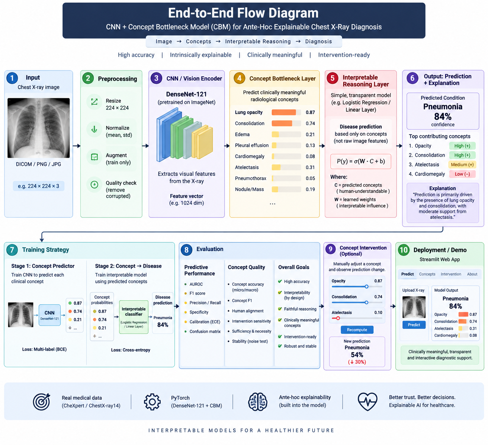
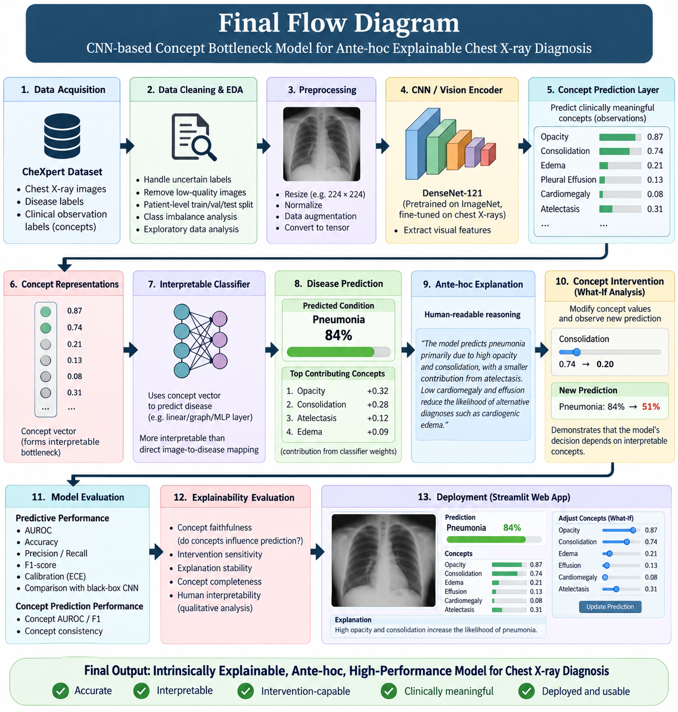

# DDERA — Architecture

How the methodology maps onto code. Read alongside [`decisions.md`](decisions.md) for *why* each
choice was made, and [`CLAUDE.md`](CLAUDE.md) for the invariants that constrain all of it.

---

## 1. The core pathway

DDERA's defining property is that the explanation lies *on* the prediction path, not beside it.

```
                    ┌──────────────────────────────────────────┐
   POST-HOC XAI     │  Image → Black box → Prediction          │   ← NOT what we build
   (rejected)       │                        ↓                 │
                    │                   Explanation            │
                    └──────────────────────────────────────────┘

                    ┌──────────────────────────────────────────┐
   DDERA            │  Image → Encoder → Concepts → Reasoner   │   ← the concepts ARE
   (ante-hoc)       │                                   ↓      │     the mechanism
                    │                              Prediction  │
                    └──────────────────────────────────────────┘
```

Concretely:

```
Chest X-ray  (1 × 224 × 224, ImageNet-normalized)
      │
      ▼
DenseNet-121 encoder  (ImageNet-pretrained, classifier removed)
      │
      ▼
Visual representation  f ∈ ℝ¹⁰²⁴
      │
      ▼
Concept head  Linear(1024 → 12) + σ
      │
      ▼
Concept vector  c ∈ [0,1]¹²      ← the bottleneck. Everything downstream sees only this.
      │
      ▼
Interpretable reasoner  Linear(12 → 1)      p = σ(w·c + b)
      │
      ▼
Target prediction  p ∈ [0,1]
```

Because the reasoner is linear, the logit decomposes **exactly**:

```
logit(p) = b + Σⱼ wⱼ·cⱼ
```

Each term `wⱼ·cⱼ` is one concept's signed contribution. This is what the dashboard's contribution
waterfall displays, and `tests/test_cbm_math.py` asserts the displayed terms sum to the logit. No
approximation, no attribution method, no sampling — the explanation is arithmetic identity.

**Concept intervention** follows directly: set `cⱼ ← v`, recompute `σ(w·c + b)`. The prediction
must move by `wⱼ·(v − cⱼ)` in logit space. This is DDERA's signature experiment, and it is only
possible *because* the bottleneck is real.

---

## 2. Reference diagrams

The two diagrams below are the canonical specification of the pipeline. Section 3 maps each
numbered stage to the module that implements it.

### End-to-end flow



### Detailed stage flow



---

## 3. Stage → module map

| Stage (diagram) | Implementation | Notebook |
|---|---|---|
| 1. Data acquisition | `scripts/get_data.py`, `ddera/data/chexpert.py` | `01` |
| 2. Cleaning & EDA | `ddera/data/labels.py`, `ddera/reporting/plots.py` | `02`, `03` |
| — Patient-level splits | `ddera/data/splits.py` | `04` |
| 3. Preprocessing | `ddera/data/transforms.py`, `ddera/data/dataset.py` | `05` |
| 4. CNN vision encoder | `ddera/models/encoder.py` | `05` |
| — Feature cache | `ddera/features/cache.py` | `05` |
| 5. Concept prediction layer | `ddera/models/concept_head.py` | `07` |
| 6. Concept representation | `ddera/models/cbm.py` | `07` |
| 7. Interpretable classifier | `ddera/models/reasoner.py` | `07` |
| 8. Disease prediction | `ddera/models/cbm.py` | `07` |
| 9. Ante-hoc explanation | `ddera/xai/intervention.py::contributions()` | `10` |
| 10. Concept intervention | `ddera/xai/intervention.py` | `10` |
| 11. Model evaluation | `ddera/eval/{metrics,calibration,bootstrap}.py` | `11` |
| 12. Explainability evaluation | `ddera/xai/{leakage,stability,completeness}.py` | `11`, `12` |
| 13. Deployment | `app/` | — |

---

## 4. Module map

```
src/ddera/
├── config.py              YAML → dataclasses; the single source of paths and hyperparameters
├── device.py              get_device() → rocm | cuda | directml | cpu, with capability report
├── seed.py                set_seed(); deterministic dataloader workers
│
├── data/
│   ├── chexpert.py        manifest construction, integrity checks, view filtering
│   ├── labels.py          uncertainty policies: U-Mask (default), U-Zeros, U-Ones, U-Ignore
│   ├── splits.py          patient-level GroupShuffleSplit, stratified on target
│   ├── transforms.py      albumentations pipelines (NO horizontal flip — see ADR-006)
│   └── dataset.py         torch Dataset for images; and for cached features
│
├── features/
│   └── cache.py           frozen-encoder feature extraction, float16 memmap + index.parquet,
│                          encoder fingerprint validation (refuses stale caches)
│
├── models/
│   ├── encoder.py         DenseNet-121, ImageNet weights, classifier removed → 1024-d
│   ├── concept_head.py    Linear(1024 → n_concepts) + σ
│   ├── reasoner.py        Linear(n_concepts → 1); weights are the explanation
│   ├── cbm.py             composition + the four training regimes
│   ├── blackbox.py        B0 baseline: encoder → Linear(1024 → 1)
│   └── protopnet.py       Phase 7, optional second ante-hoc family
│
├── train/
│   ├── loop.py            train/validate/early-stop; regime-aware
│   ├── losses.py          masked BCE (uncertainty-aware), joint CBM loss with λ
│   └── amp.py             autocast (bf16 preferred, fp16 fallback), grad accumulation
│
├── eval/
│   ├── metrics.py         AUROC, AUPRC, F1, sensitivity, specificity, confusion matrix
│   ├── calibration.py     ECE, Brier, reliability diagrams, temperature scaling
│   └── bootstrap.py       stratified bootstrap CIs (n=1000) — mandatory on headline metrics
│
├── xai/                   ★ THE METHODOLOGICAL CONTRIBUTION — domain-agnostic by construction
│   ├── intervention.py    contributions(), intervene(), TTI curves, faithfulness
│   ├── leakage.py         residual probes, concept-permutation necessity tests
│   ├── stability.py       perturbation → concept drift, rank stability, flip rate
│   ├── completeness.py    hybrid-residual sweep → empirical completeness curve
│   └── posthoc.py         Grad-CAM / SHAP / LIME — B0 BASELINES ONLY (Invariant 5)
│
└── reporting/
    ├── runs.py            log_run(), load_run(), compare_runs(); completeness enforcement
    ├── plots.py           every figure in the repo
    └── theme.py           one shared visual system
```

### Why `xai/` takes no domain arguments

Every function in `src/ddera/xai/` has a signature over
`(concepts, predictions, labels, reasoner_weights, concept_names)` and nothing else. There is no
chest-X-ray-specific code anywhere in that package. This is what makes Invariants 1, 2 and 9
testable rather than aspirational: Phase 8 runs the identical harness on VinDr-CXR with only a new
config, and if that requires a code change, the generality claim has failed and we say so.

---

## 5. Model variants

| ID | Model | Encoder | Reasoner input | Purpose |
|---|---|---|---|---|
| **B0** | Black box | fine-tuned | 1024-d features | Accuracy ceiling |
| **M1** | Independent CBM | frozen | **ground-truth** concepts | Max interpretability, min leakage |
| **M2** | Sequential CBM | frozen | **predicted** concepts | The practical default |
| **M3** | Joint CBM | fine-tuned | predicted concepts | λ sweep → **trade-off curve** |
| **M4** | Hybrid/residual CBM | frozen | concepts ⊕ residual(k) | k sweep → **completeness curve** |
| **M5** | Uncertainty-aware CBM | frozen | concepts + uncertainty | Phase 6 extension |

**M3** trains with `L = L_target + λ·L_concept`. Sweeping λ traces the interpretability↔accuracy
frontier: low λ approaches a black box that happens to have a bottleneck, high λ enforces faithful
concepts at some accuracy cost.

**M4** is the sharpest instrument in the project. A residual channel of width `k` lets task
information bypass the bottleneck. `AUROC(k) − AUROC(0)` therefore measures, empirically, how much
predictive information the 12 concepts fail to carry. Concept completeness becomes a measured
quantity rather than an assertion.

> **Invariant 3/4 note.** B0 and M4 are the *only* models with a path from encoder features to the
> target, and both exist specifically to quantify what the bottleneck costs. Neither is ever
> presented as DDERA's model, and M4's residual width is always reported alongside its metrics.

---

## 6. Data flow and artifacts

```
CheXpert download
      │
      ▼
manifest.parquet          patient_id · study · view · path · 14 labels · h · w
      │  ddera/data/chexpert.py
      ▼
splits.parquet            + split ∈ {train, val, test}   (patient-disjoint — enforced by tests)
      │  ddera/data/splits.py
      ▼
features/{split}.npy      float16 memmap, N × 1024   +   index.parquet   +   fingerprint.json
      │  ddera/features/cache.py            (valid only while the encoder is frozen)
      ▼
experiments/runs/<run_id>/
      ├── config.yaml            fully resolved — reproduces the run exactly
      ├── metrics.json           all 8 metric families + bootstrap CIs
      ├── predictions.parquet    per-sample: concepts, target prob, labels
      ├── concept_weights.json   the reasoner's w and b — the explanation itself
      └── checkpoint.pt          (gitignored)
      │
      ├─────────────────────────► experiments/runs_index.csv   (committed)
      │
      └─────────────────────────► app/  — the dashboard reads these files, never hardcoded numbers
```

`predictions.parquet` is deliberately the substrate for the entire Phase 5 XAI protocol. Every
leakage, stability, faithfulness and completeness computation runs off it rather than off a live
model, which means the protocol is reproducible from artifacts alone and can be re-run without a GPU.

### Feature-cache invalidation

`fingerprint.json` records the encoder weights hash, input resolution, and normalization constants.
`cache.py` compares before serving and raises rather than returning stale features. This matters
because **M3 (joint) and B0 fine-tune the encoder** — their features are not the cached ones, and
silently reusing the cache would invalidate every downstream metric.

---

## 7. Compute architecture

Two execution profiles, one codebase. `ddera/device.py` resolves the backend; nothing else in the
codebase branches on hardware.

| Profile | Hardware | Runs |
|---|---|---|
| **Training** | Linux + ROCm, RX 6800M (gfx1031 → gfx1030), 12 GB | Feature extraction, B0, M3 joint sweep |
| **Analysis / demo** | Any, CPU is fine | All frozen-encoder variants, the whole XAI protocol, the dashboard |

VRAM strategy for 12 GB: 224² at the batch size measured by the Phase 0 probe, AMP autocast
(bf16 preferred), gradient accumulation for larger effective batches, and torchvision's
`memory_efficient=True` DenseNet (gradient checkpointing) if headroom is tight.

The split exists because of ADR-008: once features are cached, the concept head and reasoner are
small linear models. That is what makes the full research scope — several sweeps and a large
evaluation protocol — feasible on one laptop GPU **without** reducing the methodology.

---

## 8. The evaluation protocol

A run is not complete until `metrics.json` contains all eight families (Invariant 6, enforced in
`reporting/runs.py`):

| # | Family | Module | Answers |
|---|---|---|---|
| 1 | Predictive performance | `eval/metrics.py` | Is it accurate? |
| 2 | Calibration | `eval/calibration.py` | Are its probabilities meaningful? |
| 3 | Concept quality | `eval/metrics.py` | Can it identify its own concepts? |
| 4 | Intervention curves (TTI) | `xai/intervention.py` | Does correcting concepts help? |
| 5 | Leakage | `xai/leakage.py` | Does information bypass the bottleneck? |
| 6 | Completeness | `xai/completeness.py` | How much do the concepts fail to carry? |
| 7 | Faithfulness | `xai/intervention.py` | Does `∂p/∂cⱼ` match the claimed `wⱼ`? |
| 8 | Stability | `xai/stability.py` | Do concepts survive irrelevant perturbation? |

Families 4–8 are the reusable contribution. Families 1–3 are table stakes that any CBM paper
reports; 4–8 are what make the interpretability claim falsifiable rather than decorative.

---

## 9. Application architecture

```
app/
├── Home.py                    Overview — the pitch, headline results, trade-off curve
├── pages/
│   ├── 1_Data.py              Cohort, label/concept distributions, co-occurrence, split integrity
│   ├── 2_Model.py             Model comparison, ROC/PR, calibration, per-concept quality
│   ├── 3_Explainability_Lab.py  ★ live concept intervention
│   └── 4_Methodology.py       The protocol, the diagrams, limitations
├── components/                shared widgets: concept bars, contribution waterfall, metric cards
└── .streamlit/config.toml     theme
```

The Explainability Lab is the demonstration of the whole thesis:

```
select / upload X-ray
      → encoder → concept vector
      → concept bars (predicted value per concept)
      → contribution waterfall (wⱼ·cⱼ, signed, summing exactly to the logit)
      → intervention sliders
      → recomputed prediction + delta
```

All result pages read `experiments/runs/*/metrics.json`, so the dashboard cannot drift out of sync
with the actual experiments. Inference is CPU — a single DenseNet-121 forward pass is ~100 ms.

A permanent disclaimer states the system is a **research and educational demonstration only, not a
clinical diagnostic device.**
